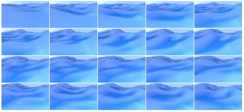

# DeepWater: a Blender ship motion and wave simulator

# Install requirements

## 0 Install Blender (Linux)
(full version https://wiki.blender.org/wiki/Building_Blender/Linux/Ubuntu)

## 1 Get the source

    mkdir ~/blender-git
    cd ~/blender-git
    git clone https://git.blender.org/blender.git
    cd blender
    git submodule update --init --recursive
    git submodule foreach git checkout master
    git submodule foreach git pull --rebase origin master

- ### 1.1 If you want to update Blender' source code to the latest development version, in ~/blender-git/blender/ run:

    make update
    
    
## 2. Install/Update the dependencies
  - ### 2.1 Recommended to use install_deps.sh script. To use it you are only required to install the following dependencies:

        git, build-essential
        for git: sudo apt-get install git
        for build-essential: sudo apt-get install build-essential

  - ### 2.2 Then, get the sources and run install_deps.sh

        cd ~/blender-git
        ./blender/build_files/build_environment/install_deps.sh

## 3. Compile Blender with CMake
  - ### 3.1 Installing CMake

         sudo apt-get -y install cmake

  - ### 3.2 Automatic CMake Setup

        cd ~/blender-git/blender
        make

    - #### Once the build finishes you'll get a message like:

          Blender successfully built, run from: /home/me/blender-git/build_linux/bin/blender

  - ### 3.3 Updating your local checkout and rebuilding is as simple as:

         cd ~/blender-git/blender
         make update
         make    

Your are done!

If you want to Edit the CMake Parameters go to https://wiki.blender.org/wiki/Building_Blender/Linux/Ubuntu

# To run the script from the terminal:
(more info: https://learnsharewithdp.wordpress.com/2018/08/27/how-to-run-a-python-script-in-blender/)

    blender filename.blend --python script.py in our case
    blender ocean_render_2.blend --python 4macro.py

# Programs
## parameters.py
Here you have all the parameters that the macro is goingo to import. You can select to iterate between several parameters. Those parameters are only choppiness, wave scale, wind velocity and random seed. Is not very difficult to add more parameters but those are the parameters that are more important to change the simulation. Here: https://docs.blender.org/manual/en/dev/modeling/modifiers/simulate/ocean.html you can find what does each parameter exactly do related to the ocean creation. The parameters about the render are clearly explained in the code.

## macro.py
The main script running the simulation, whose documentation indicates how to change diverse parameters (theorically you will not need to change anything here but the explanations inside will guide you to add different functions).

## VideoMaker.py

A sea wave video maker script that allows creating videos from frames from different episodes. You have to specify as input 1) the folder of the episode containing generated frames, and 2) the folder where you want to save the output video. For example, in order to save the video in the same path as the data folder, run:

    python3 VideoMaker.py -i data/2021204820 -o data/20190421204820

# Data

Rendering 2 frames per second: This is the best option so that the differences between two frames are noticeable and there is no visual information duplication.

Generated data

  

# Contact:

Manuel Cortés Batet batetcortesm@gmail.com

Nazar Mykola Kaminskyi nazar-mykola.kaminskyi@ensta-paris.fr

Natalia Diaz-Rodriguez natalia.diaz@ensta-paris.fr

